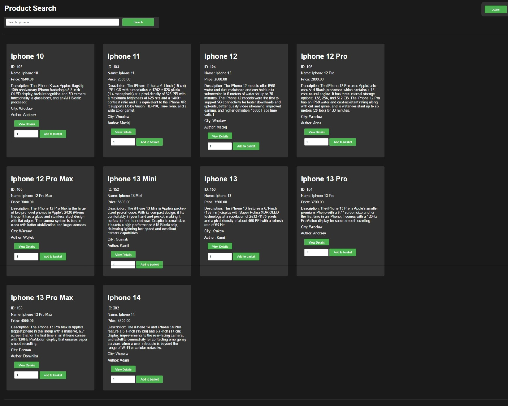
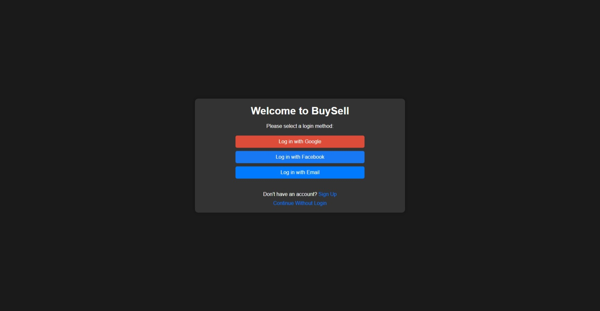
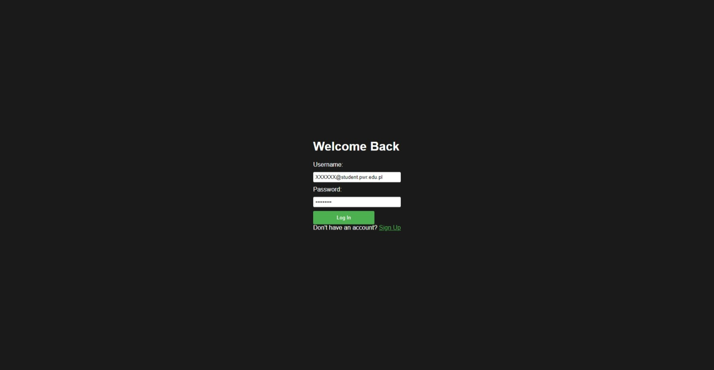
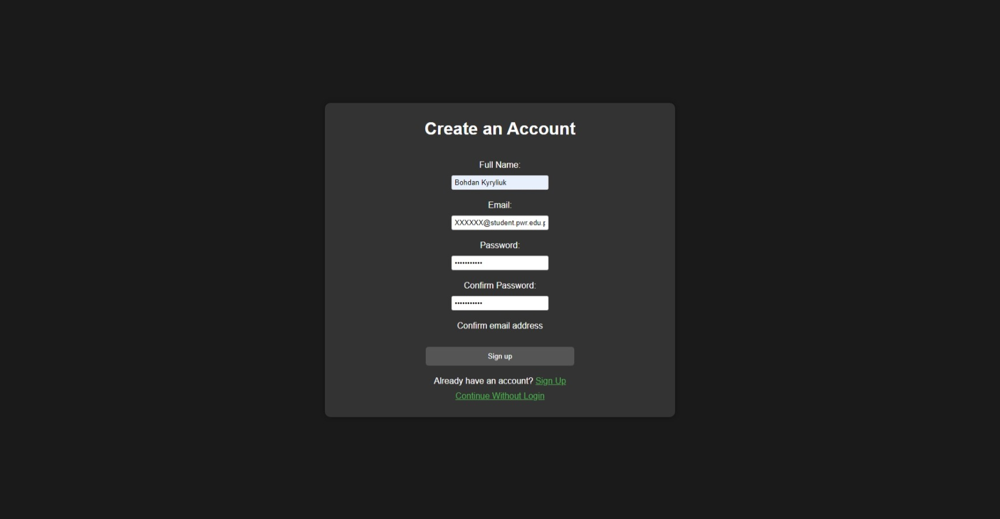
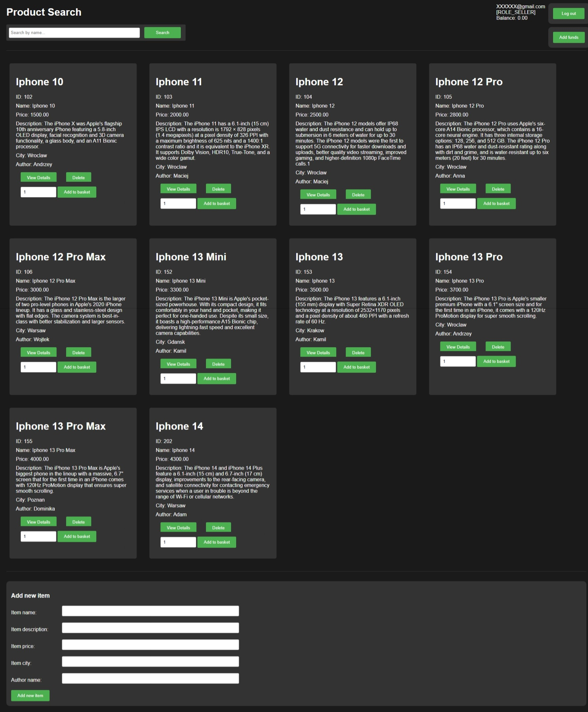
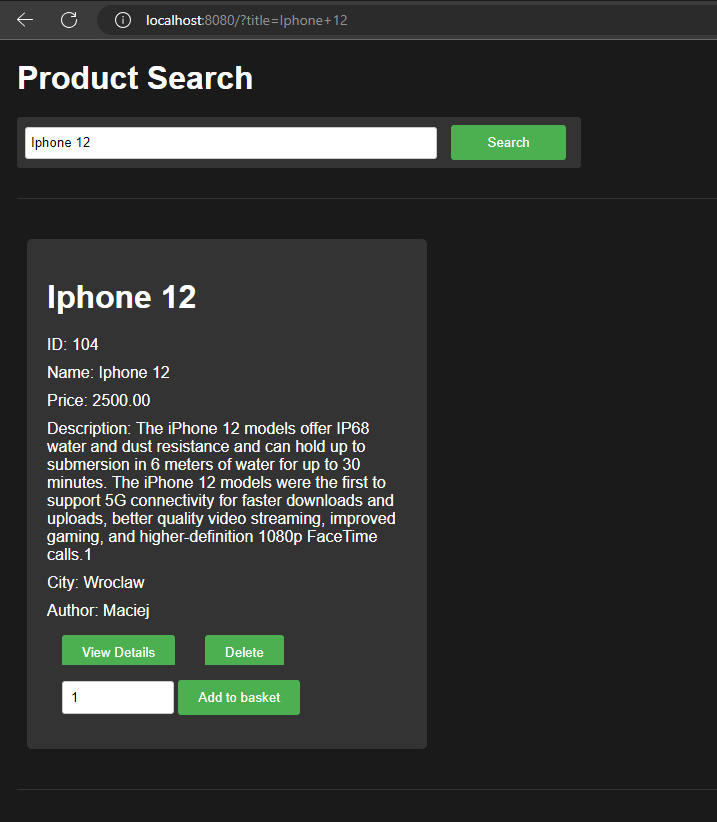
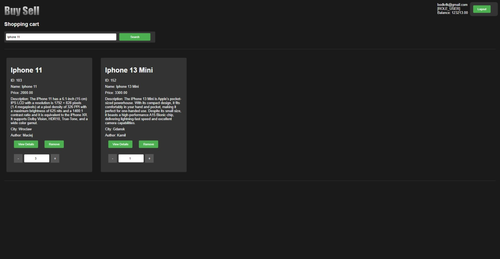
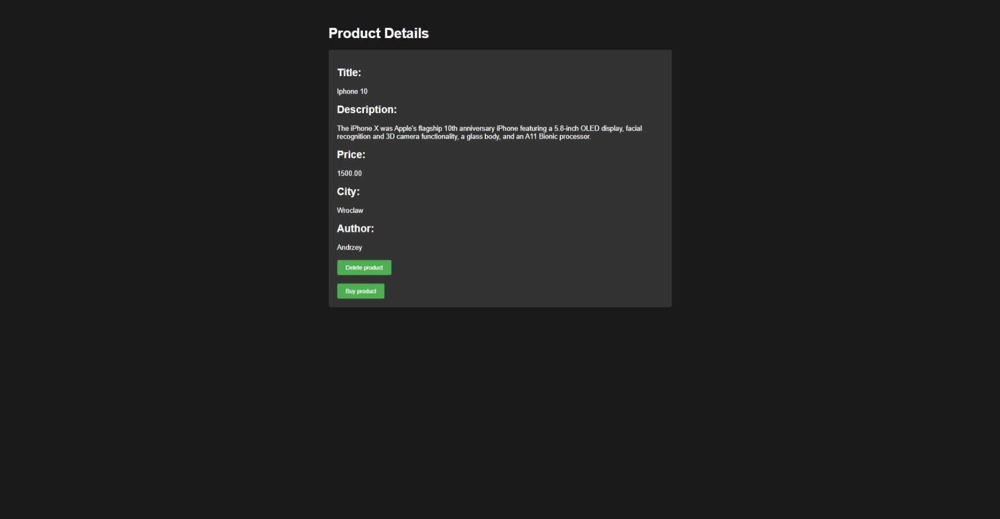
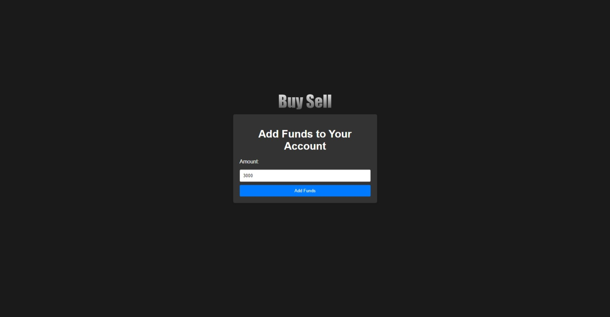
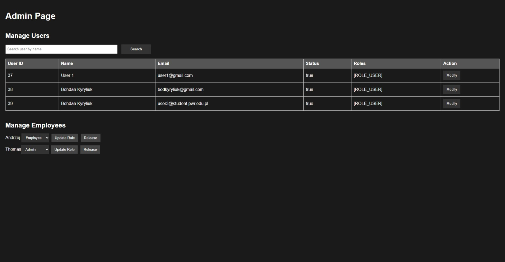

# Buysell
The BuySell Web Application is a feature-rich e-commerce platform developed using Spring Boot, Thymeleaf, HTML, CSS, and a touch of JavaScript. It provides a seamless online shopping experience for users, supporting various roles, user authentication, and email verification. The application is connected to a MySQL database for storing user information and product listings.
## Table of Contents
- [Features](#features)
- [Getting Started](#GettingStarted)
- [Usage](#Usage)
- [Screenshots](#Screenshots)

## Features
- User Authentication and Authorization:
  - Users can sign in to the platform using their Google accounts or by registering with their email and password.
  - Email verification is implemented to ensure the authenticity of user accounts. Users receive a confirmation email with a link to verify their email addresses.

- User Roles:
  - The application defines four distinct user roles: User, Seller, Manager, and Admin.
  - User: Can browse products, top up their account balance, and make purchases.
  - Seller: Has the ability to create and manage product listings for sale.
  - Manager: Has the opportunity to delete products. Partially implemented role (future expansion).
  - Admin: Empowered to manage user accounts and sellers, including updating their information and roles.

- Product Listings:
  - Sellers can create and list new products for sale on the platform.
  - Users can browse and search for products by title, view product details, and make purchases.

- User Account Management:
  - Users can top up their account balances to facilitate easy and convenient purchases.

- Shopping Cart Feature
  - Shopping cart feature simplifies the user's shopping experience.
  - Users can effortlessly add products, adjust quantities, and review their selections.
  - The cart allows them to manage their orders, making it easy to finalize purchases with precision.

- Admin Capabilities:
  - Admins have comprehensive control over the platform, enabling them to manage user accounts, sellers, and roles.
  - Admins can update user details, assign roles, and maintain the integrity of the platform (in future).

- User-Friendly Interface:
  - The application features an intuitive and user-friendly interface designed with Thymeleaf templates, HTML, and CSS.
  - Minimal JavaScript is used to enhance the user experience.

- Database Integration:
  - MySQL is used to store user account information, product listings, and other essential data.
  - 
## Getting Started
The BuySell Web Application is a web-based e-commerce platform designed to run locally on your machine. Follow the steps below to get the application up and running for development and testing purposes.

### Prerequisites
Before you begin, ensure you have met the following requirements:

- Java Development Kit (JDK): Install JDK 8 or higher. You can download it from Oracle or use an open-source version like OpenJDK.

- MySQL Database: Install and configure a MySQL database server. You can download MySQL from the official website or use a containerized solution like Docker.

- Google API Credentials (for Google Sign-In): If you plan to use Google Sign-In, create OAuth 2.0 credentials for your application on the Google Developers Console.

### Installation
- Clone the repository to your local machine using Git:

  - Copy code git clone https://github.com/bodyakyryliuk/buysell

### Configure the application.properties file:

- Open the src/main/resources/application.properties file.
- Configure the database connection properties (e.g., spring.datasource.url, spring.datasource.username, spring.datasource.password).
- If you're using Google Sign-In, add your Google OAuth 2.0 credentials to the properties file.

## Usage
- Use the application as a guest, sign in with your Google account, or register with your email and password.
- Explore product listings, make purchases, or create your own listings if you have a seller role.
- Admins can manage user accounts and roles as needed.
# Screenshots

After opening the web site, you will be redirected to main page as a guest

You can see product listing, sign up or login when you are guest.
There you can choose a way of login: github, google, email
Google and github authorizations don't require registration.

If you choose google authorization, you will be redirected to real google authorization form.
If you prefer email login page, you will be redirected there:

If you are not registered, there is a link to email sign up page.

If you confirmed your email address and registration is successfull, you can easily log in.

After successfull authorization, now you are logged in as a user. You have your shipping cart, balance, you have an opportunity to buy items.

Seller has the same features and is able to create new items to sell:

You can easily search items by typing it's title into the search field:

You are able to visit your shipping cart and manage products there:

You can click on the "View Details" button to check details and but the item:

If you want to buy something, there is a need to top up your account, if money is not enough:

Administrator has an opportunity to manage users and employees:

